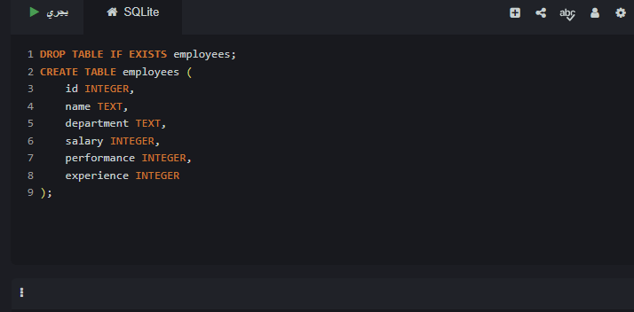
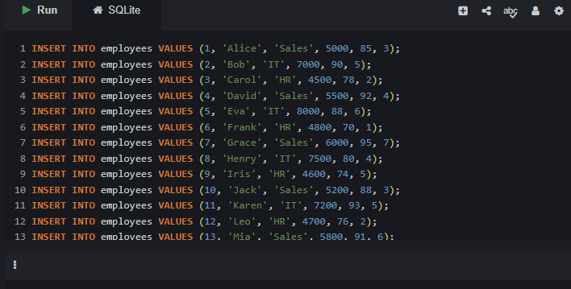
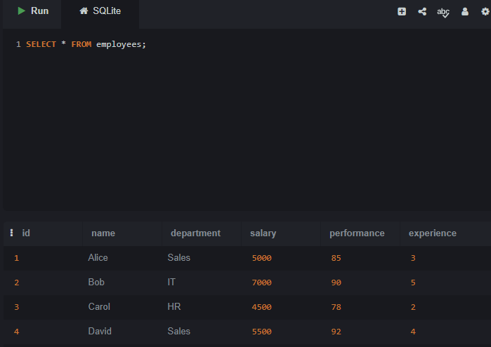
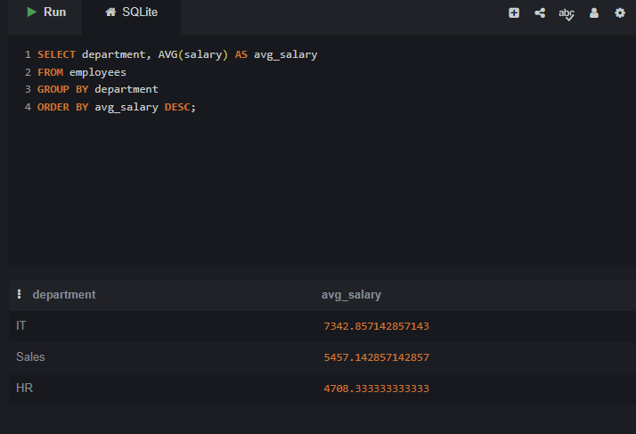
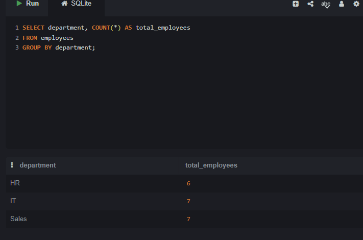
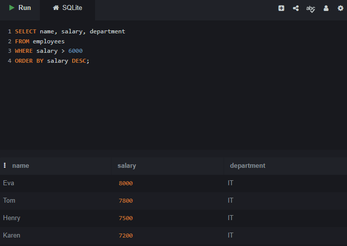
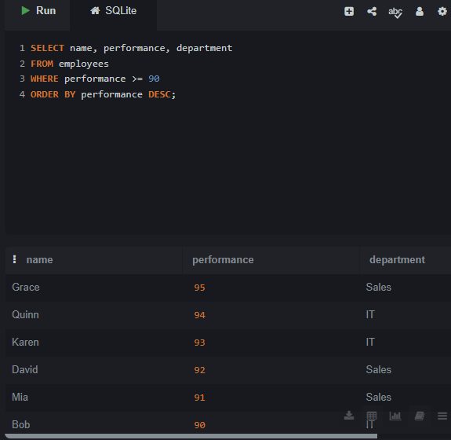
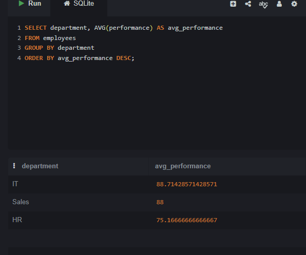
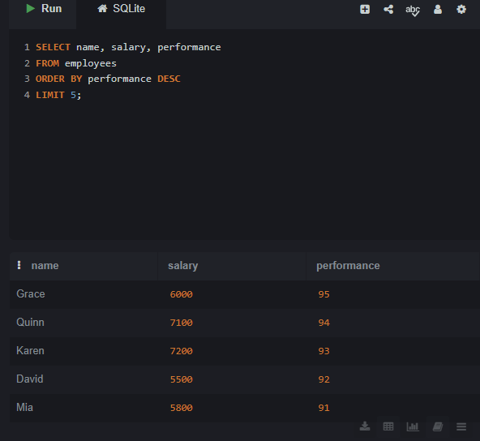

# Employee Performance Analysis

## Problem
The company needs to identify top-performing employees,
understand salary distribution across departments,
and find which department has the best overall performance.

## Dataset
- 20 employees
- Departments: Sales, IT, HR
- Columns: ID, Name, Department, Salary, Performance Score, Experience

## Tool Used
- SQL (SQLite)

## Key Findings
- IT department has the highest average salary
- Grace is the top performer with a score of 95
- IT department has the best average performance
- 7 employees have a salary above $6,000

## Decision & Recommendations
- Invest more in IT department as it has the best performance
- Review HR salary structure as it has the lowest average salary
- Study Grace and Quinn's work style as top performers

## Analysis Steps & Results

### Step 1: Create Table

### Step 2: Insert Data

### Step 3: All Employee Data

### Step 4: Average Salary by Department

### Step 5: Total Employees by Department

### Step 6: Employees with Salary above $6,000

### Step 7: Top Performers (score >= 90)

### Step 8: Average Performance by Department

### Step 9: Top 5 Employees by Performance

## Files
- employee_analysis.sql : All SQL queries
